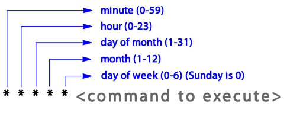

Date: 08-05-2020. Start Time: 0855

We will dedicate a few hours to this task, hopefully we can learn something new
have fun implementing a cron job. This document also serves as a resource pool for
the solutions report that is required later on (easier to log as we go along
than have to recall everything implemented in my opinion).

#### 1) First things first, Learn more about cron jobs.
Specifically: How they are set up and how a standard one might work. Look for basic implementations and go from there.

How Cron Works:

Syntax is made of 5 fields, then a shell command to execute https://en.wikipedia.org/wiki/Cron.
Note: Job is executed when time/date is matched by fields. However, there exists an exception
whereby if "day of month" and "day of week" are specified (so not matching all *), then either 
one or both of the month or week must also match the day of execution.

Fields:

`@minute @hour @day_of_month @month @day_of_week <COMMAND TO EXECUTE>`

Whereby:
- @minute: (0-59)
- @hour: (0-23)
- @day_of_month: (1-31)
- @month: (1-12)
- @day_of_week: (0-6), Sunday is 0
- There is also @reboot to run on start-up. 

A nice template: (https://code.tutsplus.com/tutorials/scheduling-tasks-with-cron-jobs--net-8800)


#### 2) At this point I realise the original task is to Implement this in Python.
Learning about Cros was quite fun, some resources to help implement (for future self-reference) are:
-  https://www.youtube.com/watch?v=QZJ1drMQz1A
-  https://www.ostechnix.com/a-beginners-guide-to-cron-jobs/

Moving on to the actual task (Time is now 1000 ;<).
- We find a nice and lightweight package that can help us: https://schedule.readthedocs.io/en/stable/
    - It can also be acknowledged there is the package Crontab: https://pypi.org/project/python-crontab/.
    However, we tick with schedule for the following reasons:
        1) I believe we can implement a more first-principles 'basic' command line cron scheduler
        that is based on Python.
        2) It appears other people have tried using python-crontab in docker without success: https://stackoverflow.com/questions/26822067/running-cron-python-jobs-within-docker, not to say that we cannot try but for a first approach
        will just go with something simple.
        3) Schedule is very lightweight and hopefully meets the spec of 'minimal impact on system'.


Time: 1025, BREAK!
Return Time: 1043

- We still want to have a cron-style service, however. So for the same given fields as an input as one might
in a cron table, we run a shell command.
    - Thinking of using command line arguments, for ex:
    `python cron_job.py -ct * * * * *  -sc echo hello world`

Not as many notes here, started writing code.. Comments can be seen for steps.

Time now: 1311, took half an hour out at somepoint to grab some food.
Looks like for the version.1 we will have command line args parsed that are strings.
To see full extent, input `python main.py --help`
An example:
```
python main.py 
    -MM "*" \
    -HH "*/5" \
    -DW "0,1,2,3" \
    -DM "*" \
    -mm "1" \
    -sc echo hello world! 
```
For each month (MM), every 5th hour (HH), on Sunday, Monday, Tuesday and Wednesday (DW),
on every day of the month (DM) at the first minute past the hour (mm), run the 
shell command 'echo hello world!'.

-> Todo now: Implement logic

Hmm, seems schedule does not handle month very well. Lets go back to python-crontab.
We will keeep the input the same, just change the package we use.

Time is 1405. Disliking the other packages that are out there, we will instead switch to
implementing a custom solution with datetime.

Input now: `python main.py -sc "echo hello world!" -ct "* * * * *"`

Who needs packages anyway? Time is 1522, looks like we might be working on this
for a bit longer. Code base is atrocious and will need some refactoring after..

This is looking pretty decent, I should have had more confidence in building a custom sol
in hindsight instead of looking to offload work to other packagess.

Time now is 1610, going to stick to original plan and try to get as much done as possible
before the self-imposed / recommended time limit of a day. So will stop at 1700 and will
write up a report tomorrow which hopefully should not take too long.

Runs! Have not tessted extensively.
We also want to limit the amount of computation this uses up. Perhaps
if we just run once every second or so things to work on. However, as promised, we will
stop here ;<. Finish time: 1706.
`python main.py -sc "echo hello world" -ct "* * * * *"`

Time: 1931 -> Not modifying the script, but found out we can reduce CPU priority 
by passing 'nice' in command line https://en.wikipedia.org/wiki/Nice_%28Unix%29.
So can run `nice -n 19 python main.py -sc "echo hello world" -ct "* * * * *"` meaning the
script has a lower priority and other processes demand access to the CPU. Simultaneously
we may want to ensure that the script still runs could be something to consider when
making this compromise.

10/05/2020:
Another way we can improve the system archietcture. Load all the potential cron
jobs into script and then check against all so we only continuously run one
thread. Need to test so that performance is not impacted too severly.

Okay, did some minor wiki edits. Great, turns out not asss many as I initially thought
I would and the documentation is better than I had originally perceived. Perhaps
it required some patience and my mindset during the coding challenge was
one that tried to rush understanding. Good takeaway.

Things to note:
- We may not be able to completely capture how time is processed in cron, may need several rules to aid in this
    - I believe I am only touching cron at a surface level, there are other functionalities such as permissions and
    time zone handling that could be future todo's
    - The more things we implement, the more places our code can break. Requires testing 
- Scheduler does not have functionality to do day of month or day of month. Maybe we do not need this at all then.
    - I have tried my best to make scheduler replicate the inputs
    one might use for crontime. This has the advantage of being familiar for crontime users and simultaneously the disadvantage of not limiting the scheduler specifically for crontime usage.

Further Work: <br>
I wanted to apply the time restriction of a few hours for the task, maybe as a Data Scientist one could get
away with this by passing it on to a Software Engineer who would be more experienced in handling this type of issue. Though
from past experience, in a start-up, everyone kind of does everything. Below are some suggestions I am able to think of:
- What if we want to schedule multiple jobs?
    - Maybe turn this into a package. Open source it so other people can use and contribute
- If we want to run this in a Docker container, we would need time zone specification and conversion
    - Time in docker is UTC/GMT (Coordinated Universal Time / Greenwich Mean Time).
- Make compatible for users with non unix-like OS? Coincides with dockerising.
- Raise error if input is wrong/faulty.
- @reboot is not handled right now, could be spec for future work.
- Test time and run in background on silent mode
    - Optimise time:
        - Parallelise
        - Run on GPU?


#### Assumptions:
- Cron Jobs Only works for Unix-like OS: https://en.wikipedia.org/wiki/Unix-like, -> Runs on top
of Unix shell so in theory we can execute any shell script https://en.wikipedia.org/wiki/Unix_shell.
    - In this, Cron jobs may not work for non-unix OS, which kinda sucks for those who can't access it.

#### Things to Try:
-  speed of running in Python vs non-python
    - Python is essentially a wrapper?
-  can we parallelise with Python packages?
-  can we speedup by taking advantage of how Python loads things into memory? (8's)

#### Diverging Thoughts from exact task:
- Can be great to automate system maintainence and mundane jobs (so said captain obvious).
    - Could this get problematic if we are too reliant on it? How would one
    keep track of too many cron jobs?
    - Context of BigPay (from call with Dr. Richard Watts): Could help to audit, 
    execute scripts on a specific day and time each month to get numbers in a 
    (more)consistent manner, as you can in theory run a script at an 'exact' time.
- Wikipedia page description is quite difficult to read in interpreting cron job and the
time fields, I had to read the same lines quite a few times to understand.. 
Think I'll have to go back and edit to improve the description after this challenge 
is completed.
    - If I do update the Wikipedia page too well, does this mean Dr. Watts has to think of
    another interview question for the next candidate? loll
- Cron job fields don't entirely make logical sense from a time ordering perspective, 
it would make more sense to me if the time duration was increased in order. So
`@minute @hour @day_of_week @day_of_month @month` would make more sense to me.
- Seems quite self-absorbed to also call Greenwich Mean time as the coordinated *universal* time. 
    - Also, UTC would imply that the non-abbreviated is 'Universal Time Coordinated', not
    'Universal Coordinated Time' (UCT).. Oh dear.
- Hmm, in hindsight I should have created a git repo earlier and do regular commits so that
Dr. Watts can assess my working progress over time..

#### Learnt Trivia:
- Unix came out of Bell Labs
- UTC = Universal Coordinated Time, and is the same as GMT (Grenwich Mean Time)
